# VPN Integration - Message Flow Diagrams

## Overview

This document describes all message-passing interactions in the VPN integration. All communication is explicit via HTTP APIs (wg-easy) and Telegram Bot API. No hidden in-process coupling exists.

---

## Diagram 1: User Requests VPN Config via Telegram

**Actors**: User, Telegram Bot, wg-easy API, WireGuard, QR Generator

```mermaid
sequenceDiagram
    participant User
    participant TelegramAPI as Telegram API
    participant Bot as vpnTelegram Bot
    participant WgEasyAPI as wg-easy API
    participant WireGuard as WireGuard Daemon
    participant QRGen as QR Generator (Bot)

    User->>TelegramAPI: /request
    TelegramAPI->>Bot: Update (message)

    alt User not in whitelist
        Bot->>TelegramAPI: sendMessage("Access denied")
        TelegramAPI->>User: ❌ Access denied
    else User authorized
        Bot->>WgEasyAPI: POST /api/session {password}
        WgEasyAPI-->>Bot: {sessionToken}

        Bot->>WgEasyAPI: POST /api/wireguard/client {name: user_123_1730000000}
        WgEasyAPI->>WireGuard: wg set wg0 peer {publicKey}
        WireGuard-->>WgEasyAPI: Peer configured
        WgEasyAPI-->>Bot: {client, configuration, qrcodeDataURL}

        Bot->>QRGen: Generate QR from config text
        QRGen-->>Bot: qr_code.png

        Bot->>TelegramAPI: sendPhoto(qr_code.png)
        TelegramAPI->>User: QR code image

        Bot->>TelegramAPI: sendDocument(user_123_1730000000.conf)
        TelegramAPI->>User: .conf file

        Bot->>TelegramAPI: sendMessage("Config created!")
        TelegramAPI->>User: ✅ Success message
    end
```

**Message Types**:
- **Delegation**: User → Bot (via Telegram API webhook)
- **Request/Response**: Bot → wg-easy API (HTTP POST/GET)
- **Report**: Bot → User (via Telegram API sendMessage/sendPhoto/sendDocument)
- **Control**: Bot → WireGuard (via wg-easy API, not direct)

**No Hidden Coupling**: All interactions are HTTP/Telegram API calls. Bot never directly invokes WireGuard CLI.

---

## Diagram 2: Installation Flow

**Actors**: Administrator, Install Script, Docker Compose, wg-easy Container, Bot Container

**Message Types**:
- **Control**: Admin → install.sh (menu selection)
- **Request/Response**: install.sh → Docker Engine (docker-compose commands)
- **Health checks**: Docker → Containers (HTTP GET for wg-easy, process check for bot)
- **Report**: install.sh → Admin (success message with credentials)

---

## Diagram 3: Revoke Access Flow

**Actors**: Administrator (or User self-revoke), Bot, wg-easy API, WireGuard, User

```mermaid
sequenceDiagram
    participant Admin as Administrator/User
    participant TelegramAPI as Telegram API
    participant Bot as vpnTelegram Bot
    participant WgEasyAPI as wg-easy API
    participant WireGuard as WireGuard Daemon
    participant TargetUser as Target User (if admin revoke)

    Admin->>TelegramAPI: /revoke
    TelegramAPI->>Bot: Update (message)

    Bot->>WgEasyAPI: POST /api/session {password}
    WgEasyAPI-->>Bot: {sessionToken}

    Bot->>WgEasyAPI: GET /api/wireguard/client
    WgEasyAPI-->>Bot: [{clients}]

    Bot->>Bot: Filter clients by user_id prefix

    alt No clients found
        Bot->>TelegramAPI: sendMessage("No active config")
        TelegramAPI->>Admin: ❌ No config found
    else Client found
        Bot->>WgEasyAPI: DELETE /api/wireguard/client/{clientId}
        WgEasyAPI->>WireGuard: wg set wg0 peer {publicKey} remove
        WireGuard-->>WgEasyAPI: Peer removed
        WgEasyAPI-->>Bot: 204 No Content

        Bot->>TelegramAPI: sendMessage("Config revoked")
        TelegramAPI->>Admin: ✅ Revoked

        opt If admin revoke (not self-revoke)
            Bot->>TelegramAPI: sendMessage to TargetUser
            TelegramAPI->>TargetUser: ⚠️ Access revoked notification
        end
    end
```

**Message Types**:
- **Request**: Admin/User → Bot (via Telegram)
- **Request/Response**: Bot → wg-easy API (DELETE operation)
- **Control**: wg-easy API → WireGuard (peer removal)
- **Notification**: Bot → Target User (if admin revoke)

---

## Diagram 4: Status Check Flow

**Actors**: User, Bot, wg-easy API

```mermaid
sequenceDiagram
    participant User
    participant TelegramAPI as Telegram API
    participant Bot as vpnTelegram Bot
    participant WgEasyAPI as wg-easy API

    User->>TelegramAPI: /status
    TelegramAPI->>Bot: Update (message)

    Bot->>WgEasyAPI: POST /api/session {password}
    WgEasyAPI-->>Bot: {sessionToken}

    Bot->>WgEasyAPI: GET /api/wireguard/client
    WgEasyAPI-->>Bot: [{clients}]

    Bot->>Bot: Find client by user_id prefix

    alt Client not found
        Bot->>TelegramAPI: sendMessage("No config exists")
        TelegramAPI->>User: ❌ No config
    else Client found
        Bot->>WgEasyAPI: GET /api/wireguard/client/{clientId}
        WgEasyAPI-->>Bot: {client, transferRx, transferTx, latestHandshakeAt}

        Bot->>Bot: Format status message (bytes to GB, handshake age)

        Bot->>TelegramAPI: sendMessage(status_text)
        TelegramAPI->>User: 📊 Status details
    end
```

---

## Diagram 5: Health Check and Monitoring

**Actors**: Docker Health Checker, wg-easy, Bot, Monitoring (future)

**Health Check Types**:
- **HTTP check**: wg-easy (GET / endpoint)
- **Process check**: Bot (Python process alive)
- **Restart policy**: `unless-stopped` with exponential backoff (3 retries in 5 minutes)

---

## Diagram 6: Network Isolation Architecture

**Actors**: n8n services, VPN services, External clients

**Network Isolation Rules**:
- ✅ **vpn_network** (172.21.0.0/16) - VPN services only
- ✅ **n8n_network** (172.20.0.0/16) - n8n services only
- ✅ **No bridge** between networks - complete isolation
- ✅ **External access**: Only WireGuard (51820/udp) and wg-easy UI (51821/tcp)
- ✅ **Outbound only**: Bot connects to Telegram API (no inbound ports)

---

## Message Type Summary

| Type | Source | Destination | Protocol | Example |
|------|--------|-------------|----------|---------|
| **Delegation** | User | Bot | Telegram API | /request command |
| **Handoff** | Bot | wg-easy API | HTTP POST/GET | Create client |
| **Report** | Bot | User | Telegram API | sendMessage |
| **Control** | Docker | Containers | Health checks | HTTP GET, process check |
| **Request** | Bot | wg-easy API | HTTP | GET /api/wireguard/client |
| **Response** | wg-easy API | Bot | HTTP JSON | Client config data |
| **Notification** | Bot | User | Telegram API | Access revoked message |

---

## No Hidden Coupling Verification

✅ **All interactions are explicit**:
- Bot ↔ wg-easy: HTTP API only (no shared memory, no IPC)
- Bot ↔ User: Telegram API only (no custom protocols)
- wg-easy ↔ WireGuard: Standard wg CLI (documented interface)
- Docker ↔ Containers: Health checks via HTTP/process (standard Docker)

✅ **Network isolation enforced**:
- Separate Docker networks (no accidental cross-talk)
- Defined port exposure (only 51820/udp and 51821/tcp)
- Firewall-friendly (no dynamic port allocation)

✅ **Replaceable components**:
- wg-easy → Native wg CLI (if needed)
- Telegram Bot → Discord/Slack bot (adapter pattern)
- Docker Compose → Kubernetes (message contracts remain same)

---

## Rate Limiting and Error Handling

**Bot Rate Limits** (per user):
- `/request`: 5 requests/hour (cooldown: 60 seconds)
- `/status`: 10 requests/minute
- `/revoke`: 3 requests/hour

**wg-easy API Rate Limits**:
- Global: 60 requests/minute (burst: 10)
- Per session: Not enforced (bot uses single session)

**Error Handling Strategy**:
1. **Timeout**: 10 seconds for wg-easy API calls
2. **Retry**: 3 attempts with exponential backoff (1s, 2s, 4s)
3. **Circuit breaker**: After 5 consecutive failures, disable bot for 5 minutes
4. **User feedback**: Clear error messages in Russian ("VPN temporarily unavailable")

---

## Future Extensions (STRETCH)

### MCP Server Integration (v2.0)

**MCP Endpoints** (STRETCH):
- `GET /health` - Service health
- `GET /contracts` - List API contracts
- `POST /control/start|stop|reload` - Control operations (requires capability token)
- `GET /metrics` - VPN usage metrics

---

## References

- **wg-easy API**: [GitHub](https://github.com/wg-easy/wg-easy)
- **Telegram Bot API**: [Documentation](https://core.telegram.org/bots/api)
- **WireGuard Protocol**: [Specification](https://www.wireguard.com/protocol/)
- **Docker Health Checks**: [Documentation](https://docs.docker.com/engine/reference/builder/#healthcheck)
