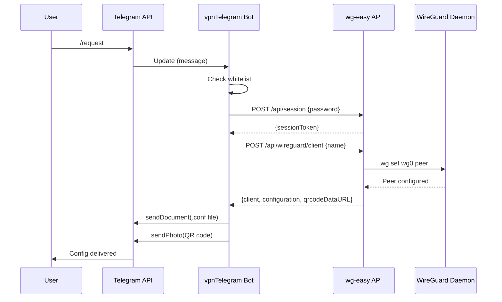
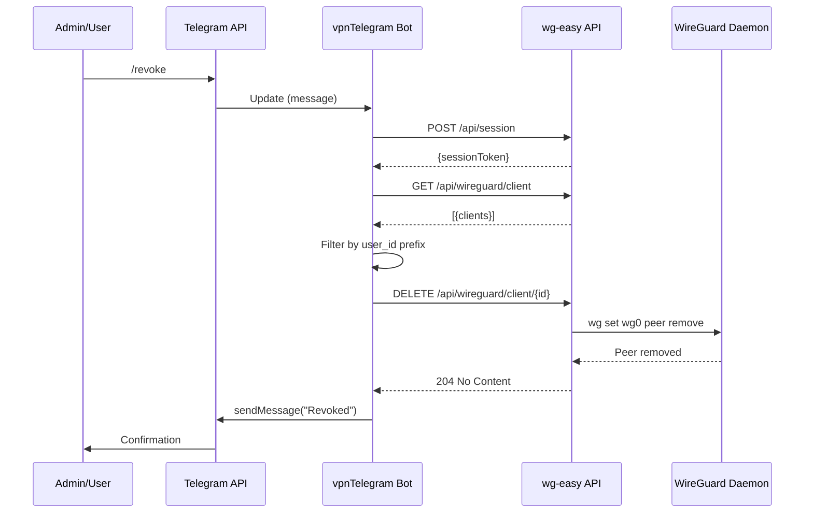
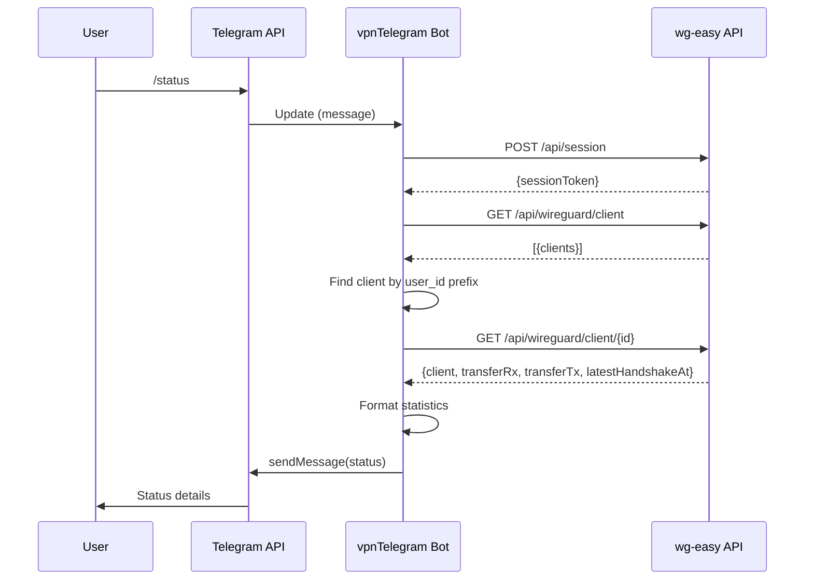
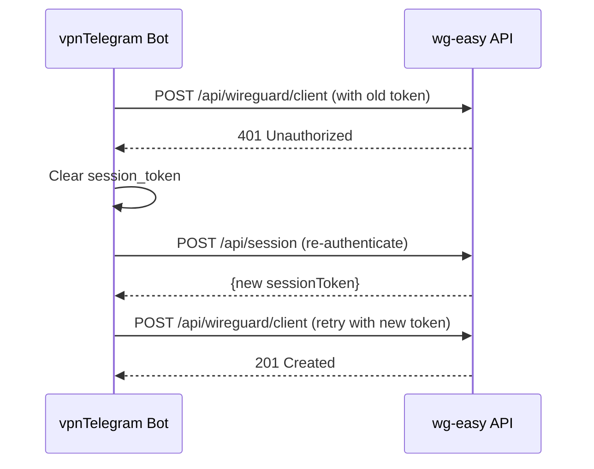
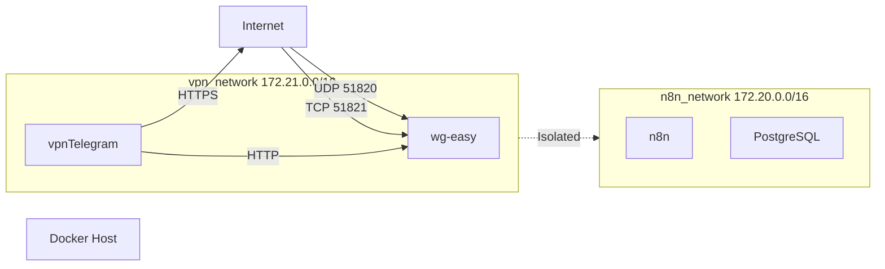

# Message Flow Documentation

## Overview

All service interactions in the VPN integration are explicit HTTP/Telegram API calls. This document annotates the message flow diagrams with implementation details for developers.

**Reference**: See `.dev-docs/diagrams/message-flows.md` for complete Mermaid diagrams.

---

## Flow 1: User Requests VPN Config



**Implementation Details**:

### Step 1: User sends `/request`
- **Telegram Client** → **Telegram API**: HTTPS
- Message format: Text command
- User authentication: Automatic (Telegram handles user ID verification)

### Step 2: Telegram API delivers message to bot
- **Telegram API** → **vpnTelegram Bot**: Long polling (30s timeout)
- Payload: `Update` object with `message.from.id` and `message.text`
- Bot receives: User ID, chat ID, command text

### Step 3: Bot validates authorization
- **Code**: `vpn-bot/src/handlers/request_handler.py:31-42`
- Checks `BOT_WHITELIST` environment variable
- Early return if unauthorized (no API calls made)

```python
if not self._is_authorized(user_id):
    await self.msg.send_message(chat_id, "❌ Access denied")
    return  # Early exit
```

### Step 4: Bot authenticates with wg-easy API
- **Bot** → **wg-easy API**: HTTP POST
- Endpoint: `/api/session`
- Request: `{"password": "<WG_PASSWORD>"}`
- Response: `{"sessionToken": "eyJhbGc..."}`
- Timeout: 10 seconds

**Code**: `vpn-bot/src/adapters/wireguard_api_adapter.py:48-62`

```python
def _ensure_session(self) -> None:
    if self.session_token:
        return  # Session already exists

    resp = requests.post(
        f"{self.base_url}/api/session",
        json={"password": self.password},
        timeout=10
    )

    self.session_token = resp.json()["sessionToken"]
```

### Step 5: Bot creates VPN client
- **Bot** → **wg-easy API**: HTTP POST
- Endpoint: `/api/wireguard/client`
- Request: `{"name": "user_123456_1730000000"}`
- Headers: `Authorization: Bearer {sessionToken}`
- Timeout: 10 seconds

**Client Naming Convention**:
```python
client_name = f"user_{user_id}_{int(time.time())}"
# Example: user_123456_1730000000
# Format: user_{telegram_id}_{unix_timestamp}
# Purpose: Prevents name conflicts, enables user lookup
```

### Step 6-7: wg-easy configures WireGuard peer
- **wg-easy** → **WireGuard**: Netlink (kernel interface)
- Command: `wg set wg0 peer <public_key> allowed-ips 10.8.0.X/32`
- Synchronous operation (blocks until complete)

### Step 8: wg-easy returns config to bot
- Response includes:
  - `configuration`: Full .conf file text (400-500 characters)
  - `qrcodeDataURL`: Base64-encoded PNG (data:image/png;base64,...)
  - `address`: Assigned VPN IP (e.g., "10.8.0.2")

**Code**: `vpn-bot/src/adapters/wireguard_api_adapter.py:75-106`

### Step 9-10: Bot generates QR code and sends config
- **Bot** generates QR code PNG from `configuration` text (not using qrcodeDataURL)
- **Bot** → **Telegram API**: sendDocument (file upload, .conf extension)
- **Bot** → **Telegram API**: sendPhoto (QR code PNG)
- **Bot** → **Telegram API**: sendMessage (instructions)

**Code**: `vpn-bot/src/handlers/request_handler.py:44-82`

**Telegram API Rate Limits**:
- 30 messages/second (global)
- 20 messages/minute per chat
- File uploads: 50MB max size

---

## Flow 2: Admin Revokes VPN Access



**Implementation Details**:

### Client Lookup by User ID

**Problem**: User doesn't know their `client_id` (UUID).

**Solution**: Lookup by `user_id` prefix in client name.

```python
# Step 1: List all clients
all_clients = self.vpn.list_clients()

# Step 2: Filter by user ID prefix
user_prefix = f"user_{user_id}_"
user_clients = [
    c for c in all_clients
    if c['name'].startswith(user_prefix)
]

# Step 3: Get first match (should be only one)
if user_clients:
    client_id = user_clients[0]['id']
    self.vpn.delete_client(client_id)
```

**Code**: `vpn-bot/src/handlers/revoke_handler.py`

### Security Note

User can only revoke their own clients because:
1. Client name includes `user_{telegram_id}_` prefix
2. Bot filters by `update.effective_user.id`
3. No way for user to specify different user ID in command

---

## Flow 3: Status Check with Statistics



**Data Formatting**:

```python
# Bytes to human-readable
def format_bytes(bytes_value: int) -> str:
    for unit in ['B', 'KB', 'MB', 'GB']:
        if bytes_value < 1024.0:
            return f"{bytes_value:.2f} {unit}"
        bytes_value /= 1024.0
    return f"{bytes_value:.2f} TB"

# Handshake age
def format_handshake_age(timestamp: str) -> str:
    if not timestamp:
        return "Never"

    age_seconds = time.time() - parse_iso8601(timestamp).timestamp()

    if age_seconds < 60:
        return f"{int(age_seconds)} seconds ago"
    elif age_seconds < 3600:
        return f"{int(age_seconds / 60)} minutes ago"
    else:
        return f"{int(age_seconds / 3600)} hours ago"
```

**Code**: `vpn-bot/src/handlers/status_handler.py`

---

## Flow 4: Error Handling - Session Expiration



**Retry Logic**:

```python
def create_client(self, name: str) -> Optional[dict]:
    self._ensure_session()

    resp = self._api_call("POST", "/api/wireguard/client", json={"name": name})

    if resp.status_code == 401:
        # Session expired, retry once
        self.session_token = None
        self._ensure_session()
        resp = self._api_call("POST", "/api/wireguard/client", json={"name": name})

    return resp.json() if resp.status_code == 201 else None
```

**Important**:
- Only retry ONCE (prevent infinite loop)
- Clear `session_token` before retry (force re-authentication)
- Log retry attempts to stderr

---

## Flow 5: Network Isolation Enforcement



**Docker Network Configuration**:

```yaml
# docker-compose.yml
networks:
  vpn_network:
    driver: bridge
    ipam:
      config:
        - subnet: 172.21.0.0/16

  n8n_network:
    driver: bridge
    ipam:
      config:
        - subnet: 172.20.0.0/16

services:
  wg-easy:
    networks:
      - vpn_network  # ONLY vpn_network

  vpnTelegram:
    networks:
      - vpn_network  # ONLY vpn_network

  n8n:
    networks:
      - n8n_network  # ONLY n8n_network
```

**Verification**:

```bash
# Bot should NOT be able to reach n8n
docker exec vpn-telegram-bot ping -c 1 n8n
# Expected: "ping: n8n: Name or service not known"

# Bot SHOULD be able to reach wg-easy
docker exec vpn-telegram-bot ping -c 1 wg-easy
# Expected: "1 packets transmitted, 1 received"
```

---

## Message Type Reference

| Type | Direction | Protocol | Timeout | Retry | Example |
|------|-----------|----------|---------|-------|---------|
| **User → Bot** | Inbound | Telegram API (HTTPS) | 30s polling | N/A | /request command |
| **Bot → User** | Outbound | Telegram API (HTTPS) | Default | 3x exponential backoff | sendMessage |
| **Bot → wg-easy** | Internal | HTTP | 10s | 1x on 401 | POST /api/wireguard/client |
| **wg-easy → WireGuard** | Kernel | Netlink | N/A | N/A | wg set wg0 peer |

---

## Error Handling Matrix

| Error Condition | Detection Point | Recovery Action | User Feedback |
|----------------|----------------|-----------------|---------------|
| **Whitelist denial** | Bot handler | Early return | "❌ Access denied" |
| **wg-easy timeout** | HTTP request | Log error, return None | "❌ Service unavailable" |
| **Session expired** | 401 response | Re-authenticate, retry once | Transparent (no message) |
| **Network partition** | Connection refused | Log error, retry 3x | "❌ Service unavailable" |
| **Telegram API failure** | requests.exceptions | Exponential backoff, 3 retries | Silent (logged) |

---

## Performance Characteristics

**Latency Measurements** (typical):

| Operation | Bot Processing | wg-easy API | WireGuard Config | Total |
|-----------|---------------|-------------|------------------|-------|
| /start | <50ms | 0ms | 0ms | <100ms |
| /request | 100ms | 500ms | 200ms | ~1-2s |
| /status | 50ms | 200ms | 50ms | ~500ms |
| /revoke | 50ms | 300ms | 100ms | ~700ms |

**Throughput Limits**:
- Bot: 30 commands/second (Telegram rate limit)
- wg-easy API: 60 requests/minute (configurable)
- WireGuard: ~100 concurrent clients (kernel default)

---

## References

- **Full Message Flow Diagrams**: `.dev-docs/diagrams/message-flows.md`
- **API Contracts**: `.dev-docs/contracts/wg-easy-api.yaml`
- **Implementation**: `vpn-bot/src/handlers/`, `vpn-bot/src/adapters/`
- **Code Review**: `.dev-docs/CODE_REVIEW_REPORT.md`
