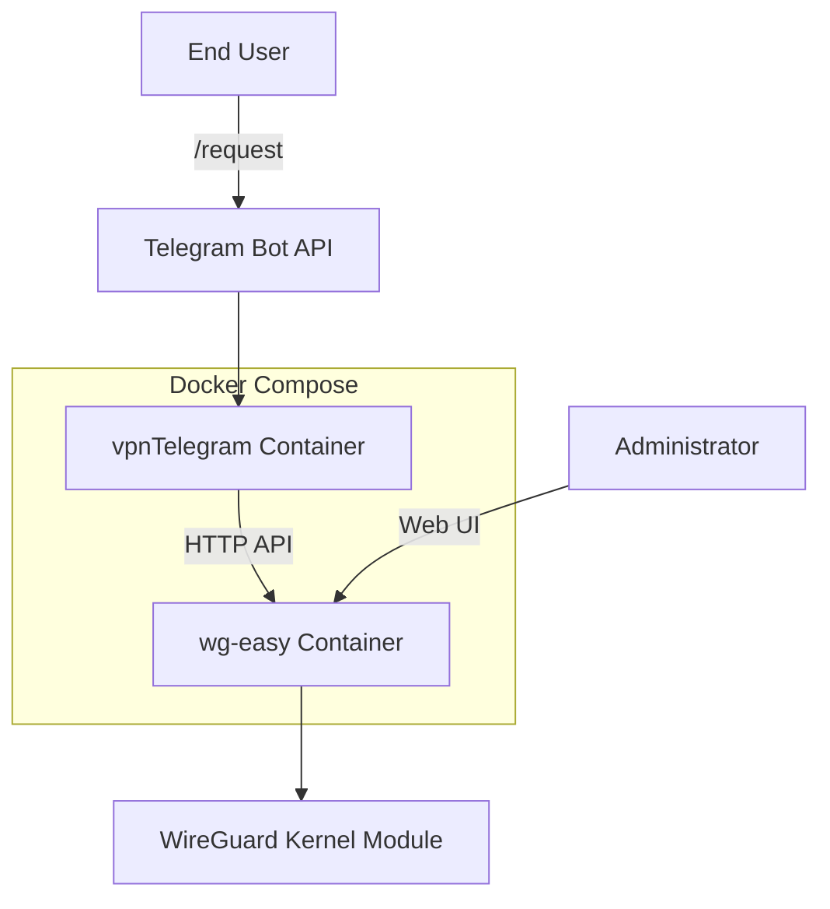
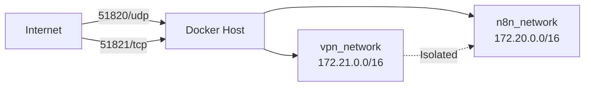
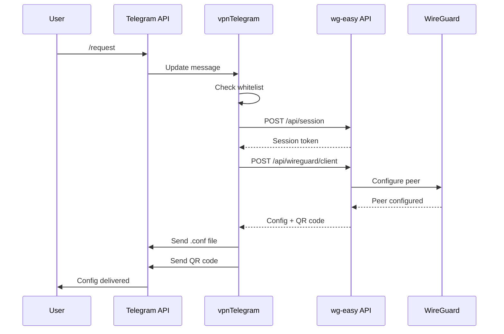
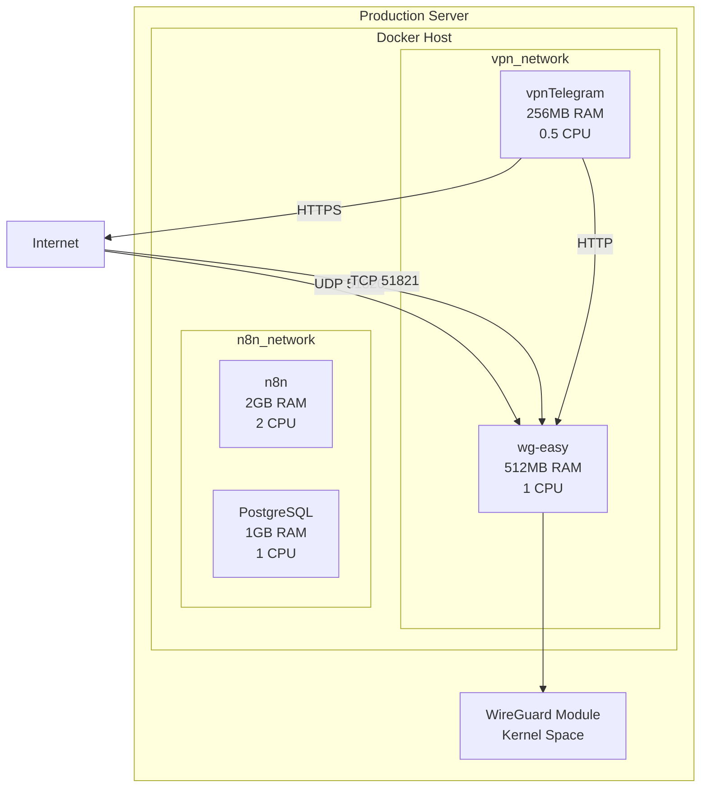

# VPN Integration System Architecture

## Overview

The VPN integration adds WireGuard-based VPN capabilities to n8n-installer through two Docker services: **wg-easy** (web UI + HTTP API) and **vpnTelegram** (Telegram bot interface).

**Key Design Principles**:
- **Minimalism**: Simple architecture with <10 dependencies per service
- **Message-passing**: All interactions via HTTP/Telegram API (no hidden coupling)
- **Network isolation**: VPN services on separate Docker network
- **Capability-based**: Whitelist + session tokens for access control

---

## Component Diagram



---

## Service Architecture

### wg-easy Service

**Purpose**: WireGuard management UI + HTTP API

**Image**: `ghcr.io/wg-easy/wg-easy:latest`
- Official image, 15k+ GitHub stars
- Pre-built web UI with client management
- RESTful HTTP API for automation

**Ports**:
- `51820/udp`: WireGuard protocol (VPN connections)
- `51821/tcp`: Web UI + HTTP API (admin access)

**Capabilities**:
- `NET_ADMIN`: Required for WireGuard interface management (cannot be removed)

**Volumes**:
- `/etc/wireguard`: WireGuard configuration persistence
- `/lib/modules:ro`: Kernel modules (read-only)

**Resources**:
- Memory: 512MB max
- CPU: 1.0 core max
- Disk: ~500MB (image + config)

**Dependencies**: None (standalone service)

**Health Check**:
```bash
curl -f http://localhost:51821/ || exit 1
```
Interval: 30s, Timeout: 10s, Retries: 3

---

### vpnTelegram Service

**Purpose**: Telegram bot for VPN config distribution

**Image**: Built from `vpn-bot/Dockerfile`
- Base: `python:3.11-slim` (minimal Python image)
- Size: ~50MB (Python + 4 dependencies)

**Dependencies** (4 total):
1. `python-telegram-bot==20.7` - Telegram Bot API client
2. `requests==2.31.0` - HTTP client for wg-easy API
3. `qrcode==7.4.2` - QR code generation
4. `pillow==10.1.0` - Image processing (QR code PNG)

**Network**: Internal only (no exposed ports)
- Outbound: Telegram Bot API (HTTPS)
- Outbound: wg-easy API (HTTP internal)

**Resources**:
- Memory: 256MB max
- CPU: 0.5 core max
- Disk: ~10MB (code + logs)

**Depends On**: wg-easy (healthy)

**Health Check**:
```bash
ps aux | grep 'python.*bot.py' || exit 1
```
Interval: 60s, Timeout: 5s, Retries: 3

---

## Network Topology



**Network Configuration**:

1. **vpn_network** (172.21.0.0/16):
   - Driver: bridge
   - Services: wg-easy, vpnTelegram
   - Purpose: VPN service isolation

2. **n8n_network** (172.20.0.0/16):
   - Driver: bridge
   - Services: n8n, PostgreSQL, Redis
   - Purpose: Existing n8n infrastructure

3. **No bridge between networks**:
   - Complete isolation (fault containment)
   - VPN issues don't affect n8n services
   - Security boundary

**Port Mapping**:
```yaml
services:
  wg-easy:
    ports:
      - "51820:51820/udp"  # WireGuard protocol
      - "51821:51821/tcp"  # Web UI + API

  vpnTelegram:
    # No ports exposed (outbound only)
```

---

## Data Flow

### User Requests VPN Config



**Step-by-Step**:

1. **User sends `/request`** to Telegram bot
2. **Telegram API** delivers message to bot (webhook/polling)
3. **Bot validates** user authorization (BOT_WHITELIST check)
4. **Bot authenticates** with wg-easy API (POST /api/session)
5. **wg-easy** returns session token (24h TTL)
6. **Bot creates client** (POST /api/wireguard/client)
7. **wg-easy** configures WireGuard peer (via kernel module)
8. **WireGuard** confirms peer configuration
9. **wg-easy** returns config + QR code to bot
10. **Bot generates** QR code PNG from config text
11. **Bot sends** .conf file as document attachment
12. **Bot sends** QR code as photo
13. **User imports** config in WireGuard app

**Error Handling**:
- Whitelist failure → "Access denied" message, early return
- wg-easy timeout → "Service unavailable" message, retry after 60s
- Telegram API failure → Exponential backoff retry (3 attempts)

---

## Architecture Layers

### Layer 1: External Interfaces

**Telegram Bot API** (outbound):
- Protocol: HTTPS
- Endpoint: https://api.telegram.org/bot{token}
- Rate limit: 30 messages/second, 20 messages/minute per chat
- Authentication: BOT_TOKEN in URL

**WireGuard Protocol** (inbound):
- Protocol: UDP
- Port: 51820
- Handshake: Noise_IK pattern (25519 keys)
- Encryption: ChaCha20-Poly1305

**wg-easy Web UI** (inbound):
- Protocol: HTTP(S)
- Port: 51821
- Authentication: Password (WG_PASSWORD)
- Session: Cookie-based, 24h TTL

---

### Layer 2: Application Logic

**Bot Handlers** (command processing):
- `/start` → StartHandler (welcome message)
- `/request` → RequestHandler (VPN config creation)
- `/status` → StatusHandler (usage statistics)
- `/revoke` → RevokeHandler (config deletion)

**Adapters** (external system integration):
- `WireGuardAPIAdapter` → wg-easy HTTP API
- `TelegramBotAdapter` → Telegram Bot API
- `QRCodeAdapter` → qrcode library
- `StdoutAdapter` → Docker logs

**Interfaces** (contracts):
- `IVPNProvider` → VPN operations (create, delete, list)
- `IMessagingProvider` → Message sending (text, photo, document)
- `IQRGenerator` → QR code generation
- `ILogSink` → Logging abstraction

---

### Layer 3: Infrastructure

**Docker Compose** (orchestration):
- Service definition (wg-easy, vpnTelegram)
- Network configuration (vpn_network)
- Volume management (wg_data)
- Health checks (HTTP/process)

**Environment Variables** (configuration):
- `BOT_TOKEN`: Telegram bot authentication
- `WG_PASSWORD`: wg-easy admin password
- `WG_HOST`: Server external IP
- `BOT_WHITELIST`: Authorized user IDs

**Volumes** (persistence):
- `wg_data`: WireGuard configuration (survives container restart)
- `/lib/modules`: Kernel modules (host mount, read-only)

---

## Deployment Architecture



**Resource Budget**:
- **Total RAM**: 768MB (wg-easy 512MB + bot 256MB)
- **Total CPU**: 1.5 cores (wg-easy 1.0 + bot 0.5)
- **Total Disk**: ~560MB (images + config)

**Server Requirements**:
- **Minimum**: 8GB RAM, 8 CPU cores (leaves 7.2GB/6.5 cores for n8n)
- **Kernel**: Linux ≥5.6 (WireGuard in-kernel) or use wireguard-go
- **Docker**: ≥20.10 (Compose V2 support)

---

## Security Architecture

### Authentication Flow

```
User → Telegram (automatic user ID verification)
      ↓
Bot → Whitelist check (BOT_WHITELIST)
      ↓
Bot → wg-easy API (session token)
      ↓
wg-easy → WireGuard (peer configuration)
```

**Capability Tokens**:
- `BOT_TOKEN`: Telegram API access (permanent, from @BotFather)
- `WG_PASSWORD`: wg-easy admin access (permanent, auto-generated)
- Session token: wg-easy API access (24h TTL, lazy creation)

**Authorization Matrix**:
| Operation | Required Capability | Verification Point |
|-----------|-------------------|-------------------|
| Send bot command | Telegram user ID | Telegram API (automatic) |
| Create VPN client | Whitelist + session token | Bot handler + wg-easy API |
| Delete VPN client | Whitelist + ownership | Bot handler (client name prefix) |
| Access web UI | WG_PASSWORD | wg-easy UI login |

---

## Message-Passing Topology

All inter-service communication is explicit:

**Bot → wg-easy**:
- Protocol: HTTP
- Messages: Session creation, client CRUD
- Format: JSON
- Timeout: 10 seconds

**User → Bot**:
- Protocol: Telegram Bot API (HTTPS)
- Messages: Commands, callbacks
- Format: Update objects
- Delivery: Polling (long polling, 30s timeout)

**Bot → User**:
- Protocol: Telegram Bot API (HTTPS)
- Messages: Text, photo, document
- Format: sendMessage/sendPhoto/sendDocument
- Rate limit: 30 msg/sec, 20 msg/min per chat

**wg-easy → WireGuard**:
- Protocol: Netlink (Linux kernel)
- Messages: Peer add/remove/configure
- Format: Binary (wg CLI wrapper)
- Execution: Synchronous

**No hidden coupling**:
- ✅ All interactions documented in message-flows.md
- ✅ No shared memory or IPC
- ✅ No database sharing
- ✅ Network isolation enforced

---

## Scalability Considerations

### Current Design (Single Server)

**Limitations**:
- Single wg-easy instance (no horizontal scaling)
- Single bot instance (stateless, can scale)
- VPN throughput: Limited by server network bandwidth

**Capacity**:
- **Max clients**: 254 (10.8.0.0/24 subnet, 1 IP reserved for gateway)
- **Max concurrent connections**: ~100 (kernel limit, tuneable)
- **Throughput**: ~1 Gbps (typical server NIC)

### Future Scaling (v2.0+)

**Horizontal Scaling**:
- Multiple wg-easy instances (different subnets)
- Bot round-robin to wg-easy instances
- Load balancer for WireGuard (51820/udp)

**Vertical Scaling**:
- Increase resource limits (wg-easy 1GB RAM, 2 CPU)
- Larger subnet (10.8.0.0/16 = 65,534 clients)

**Not Needed for MVP**: Single server supports 100+ clients (sufficient for bypass use case).

---

## Monitoring & Observability

### Health Checks

**wg-easy**:
```bash
# Docker health check
curl -f http://localhost:51821/ || exit 1

# Manual check
docker inspect wg-easy | jq '.[0].State.Health'
```

**vpnTelegram**:
```bash
# Docker health check
ps aux | grep 'python.*bot.py' || exit 1

# Manual check
docker logs --tail 10 vpn-telegram-bot
```

### Metrics (Future)

**VPN Metrics**:
- Active clients count
- Bandwidth per client (Rx/Tx)
- Handshake age (connection health)
- Client creation rate

**Bot Metrics**:
- Commands per hour
- Response time (API latency)
- Error rate (failed requests)
- Authorization denials

**System Metrics**:
- Container CPU/RAM usage
- Network throughput
- Disk I/O (config writes)

---

## Disaster Recovery

### Backup

**Critical Data**:
- `wg_data` volume (WireGuard configs)
- `.env` file (secrets)

**Backup Command**:
```bash
# Backup wg_data volume
docker run --rm \
  -v wg_data:/data \
  -v $(pwd):/backup \
  alpine tar czf /backup/wg_data_backup.tar.gz -C /data .

# Backup .env
cp .env .env.backup
chmod 600 .env.backup
```

**Backup Schedule**: Daily (cron job)

### Restore

**Restore Command**:
```bash
# Stop services
docker-compose down

# Restore wg_data volume
docker volume create wg_data
docker run --rm \
  -v wg_data:/data \
  -v $(pwd):/backup \
  alpine tar xzf /backup/wg_data_backup.tar.gz -C /data

# Restore .env
cp .env.backup .env

# Start services
docker-compose up -d wg-easy vpnTelegram
```

### Rollback

**Uninstall Script** (reverses installation):
```bash
# Stop and remove containers
docker-compose down

# Remove VPN services from docker-compose.yml
# (remove wg-easy and vpnTelegram service definitions)

# Remove VPN network
docker network rm vpn_network

# Remove volume (optional, keeps backups)
docker volume rm wg_data

# Remove .env variables (optional)
# (remove BOT_TOKEN, WG_PASSWORD, WG_HOST from .env)
```

---

## Key Design Decisions

### ADR-0001: WireGuard over OpenVPN

**Decision**: Use WireGuard protocol instead of OpenVPN.

**Rationale**:
- **Performance**: 4x faster (kernel-level vs userspace)
- **Security**: Modern cryptography (ChaCha20-Poly1305, Curve25519)
- **Simplicity**: ~4,000 LOC vs ~400,000 LOC (OpenVPN)
- **Configuration**: No PKI/certificates required

**Trade-offs**:
- ✅ Faster connections, lower latency
- ✅ Simpler configuration
- ⚠️ Requires kernel ≥5.6 (fallback to wireguard-go available)
- ⚠️ Less mature ecosystem than OpenVPN

---

### ADR-0002: wg-easy over Raw WireGuard CLI

**Decision**: Use wg-easy container instead of raw `wg` CLI.

**Rationale**:
- **HTTP API**: Enables bot automation (no shell scripting)
- **Web UI**: Provides admin interface for troubleshooting
- **QR Code**: Built-in QR generation (no external tools)
- **Maturity**: 15k+ GitHub stars, active maintenance

**Trade-offs**:
- ✅ Faster development (pre-built UI + API)
- ✅ No custom API development needed
- ⚠️ +256MB RAM overhead (acceptable for 8GB server)
- ⚠️ Dependency on third-party project

---

### ADR-0005: Network Isolation over Shared Network

**Decision**: Separate Docker network (`vpn_network`) for VPN services.

**Rationale**:
- **Fault isolation**: VPN issues don't affect n8n
- **Security**: Clear service boundaries
- **Resource management**: Easier to monitor VPN-specific traffic

**Trade-offs**:
- ✅ Better reliability (n8n unaffected by VPN crashes)
- ✅ Clearer architecture (explicit boundaries)
- ⚠️ +1 network definition in docker-compose.yml
- ⚠️ Subnet planning required (avoid IP conflicts)

---

## References

- **Architecture Contracts**: `.dev-docs/contracts/wg-easy-api.yaml`
- **Message Flows**: `.dev-docs/diagrams/message-flows.md`
- **Security Model**: `.dev-docs/capabilities/security-model.md`
- **Adapter Registry**: `.dev-docs/adapters/registry.md`
- **Code Review**: `.dev-docs/CODE_REVIEW_REPORT.md`
